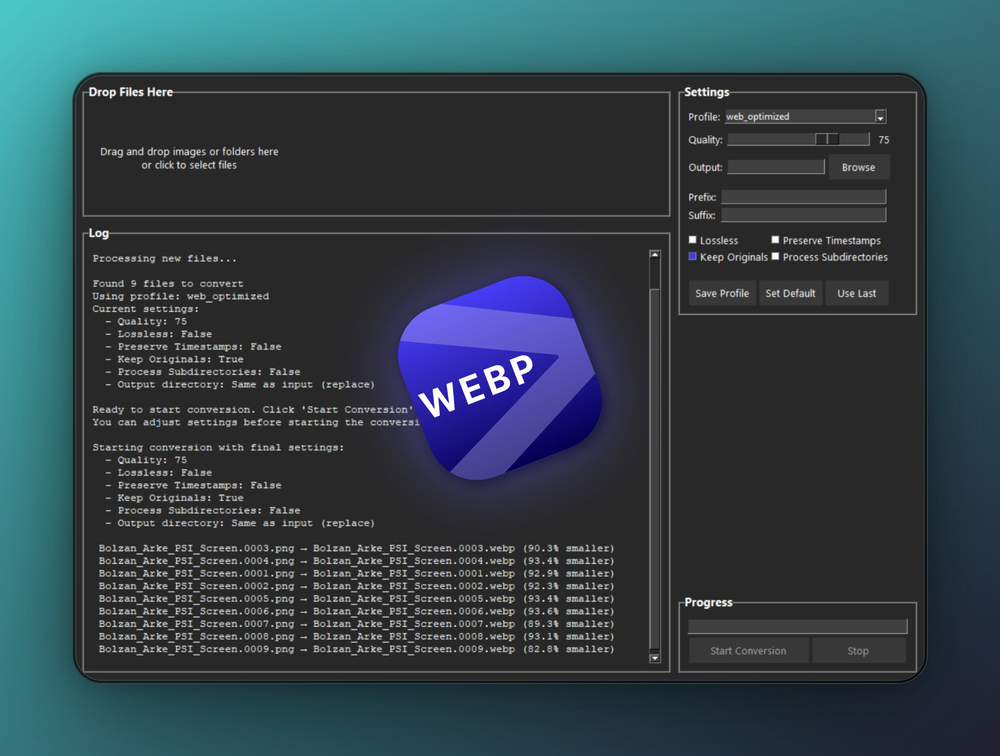

# Image to WebP Converter



A Python application to convert PNG, JPG, GIF and other image formats to WebP format, featuring both a modern GUI and command-line interface. Includes advanced features like profile management, parallel processing, and resource optimization.

## Features

- **Multiple Format Support**: Converts PNG, JPG, GIF and other image formats to WebP
- **Parallel Processing**: Fast conversion using multi-threading
- **Profile Management**: Preset and custom conversion profiles
- **Resource Management**:
  - Disk space checking
  - Memory optimization
  - CPU utilization control
- **File Handling**:
  - Recursive directory scanning
  - Original file preservation options
  - Timestamp preservation
  - Duplicate file handling
- **Progress Tracking**: Real-time conversion progress bar
- **Error Handling**: Comprehensive error checking and reporting
- **Configuration**: Save and reuse preferred settings

## GUI Features
- **Modern Dark Theme**:
  - Sleek dark background
  - Clean, minimal design
  - Responsive layout
- **User-Friendly Interface**:
  - Drag-and-drop support
  - System tray integration
  - Live quality adjustment
  - Collapsible settings panel

## Requirements
- Python 3.x
- Required packages (install via requirements.txt):
  ```
  # Core dependencies
  Pillow
  psutil
  tqdm  # For CLI progress bars
  
  # GUI dependencies
  tkinterdnd2  # For drag-and-drop
  pystray  # For system tray
  ```

## Installation
```bash
pip install -r requirements.txt
```

## Using the GUI

1. **Launch the Application**:
   ```bash
   python gui.py
   ```

2. **Convert Images**:
   - Drag and drop files/folders into the drop zone
   - Or click to select files using the file browser
   - Watch real-time conversion progress

3. **Customize Settings**:
   - Quality (0-100 slider)
   - Lossless compression toggle
   - Original file preservation
   - Timestamp preservation
   - Recursive directory processing

4. **Profile Management**:
   - Select from preset profiles
   - Save custom profiles
   - Set default profile
   - Quick-load last used settings

5. **System Tray Features**:
   - Minimize to tray
   - Quick access menu
   - Background operation

## Command-Line Usage

Basic usage:
```bash
python image_to_webp.py input_path [options]
```

Available options:
```
Core Options:
  -q, --quality VALUE      Set WebP quality (0-100)
  -o, --output PATH       Specify output file/directory
  -r, --recursive         Process subdirectories
  --lossless             Use lossless compression
  --prefix TEXT          Add prefix to output filenames
  --suffix TEXT          Add suffix to output filenames

File Handling:
  --keep-originals       Keep original files
  --delete-originals     Delete original files after conversion
  --no-preserve-timestamps  Don't preserve original timestamps

Profile Management:
  --profile NAME         Use a specific profile
  --save-profile NAME    Save current settings as new profile
  --list-profiles       Show all available profiles
  --set-default-profile NAME  Set default profile
  --use-last            Use last used settings
```

Examples:
```bash
# Convert single file with quality 85
python image_to_webp.py image.jpg -q 85

# Convert directory recursively, add prefix and suffix
python image_to_webp.py ./photos -r --prefix "2023_" --suffix "_compressed"

# Convert using a profile and custom output directory
python image_to_webp.py ./photos --profile "high_quality" -o ./webp_output

# Convert and delete originals after successful conversion
python image_to_webp.py ./photos --delete-originals
```

## Preset Profiles

### high_quality
- Quality: 95
- Lossless: Yes
- Preserve Timestamps: Yes
- Preserve Originals: Yes

### balanced (default)
- Quality: 80
- Lossless: No
- Preserve Timestamps: Yes
- Preserve Originals: Yes

### web_optimized
- Quality: 75
- Lossless: No
- Preserve Timestamps: No
- Preserve Originals: Yes

### space_saver
- Quality: 60
- Lossless: No
- Preserve Timestamps: No
- Preserve Originals: No

## Usage Examples

### Basic Usage
```bash
# Convert a single image
python image_to_webp.py image.jpg

# Convert multiple images
python image_to_webp.py folder/*.jpg

# Convert with specific quality
python image_to_webp.py image.jpg -q 85

# Convert recursively with lossless compression
python image_to_webp.py folder/ -r --lossless
```

### GUI Examples
1. **Batch Conversion**:
   - Drop multiple files into the interface
   - Select quality: 85
   - Enable "Preserve originals"
   - Click "Convert"

2. **Profile-based Conversion**:
   - Select "High Quality" profile
   - Drop files
   - Click "Convert"

3. **Custom Settings**:
   - Adjust quality slider
   - Toggle lossless mode
   - Enable recursive processing
   - Save as new profile

## Contributing

We welcome contributions! Please see our [Contributing Guidelines](CONTRIBUTING.md) for details on how to:
- Submit bug reports
- Request features
- Submit pull requests
- Set up your development environment

## License

This project is licensed under the MIT License - see the [LICENSE](LICENSE) file for details.

MIT License

Copyright (c) 2025

Permission is hereby granted, free of charge, to any person obtaining a copy
of this software and associated documentation files (the "Software"), to deal
in the Software without restriction, including without limitation the rights
to use, copy, modify, merge, publish, distribute, sublicense, and/or sell
copies of the Software, and to permit persons to whom the Software is
furnished to do so, subject to the following conditions:

The above copyright notice and this permission notice shall be included in all
copies or substantial portions of the Software.

THE SOFTWARE IS PROVIDED "AS IS", WITHOUT WARRANTY OF ANY KIND, EXPRESS OR
IMPLIED, INCLUDING BUT NOT LIMITED TO THE WARRANTIES OF MERCHANTABILITY,
FITNESS FOR A PARTICULAR PURPOSE AND NONINFRINGEMENT. IN NO EVENT SHALL THE
AUTHORS OR COPYRIGHT HOLDERS BE LIABLE FOR ANY CLAIM, DAMAGES OR OTHER
LIABILITY, WHETHER IN AN ACTION OF CONTRACT, TORT OR OTHERWISE, ARISING FROM,
OUT OF OR IN CONNECTION WITH THE SOFTWARE OR THE USE OR OTHER DEALINGS IN THE
SOFTWARE.

## Windows Executable

A standalone Windows executable is available, which doesn't require Python installation.

### Building the Executable

1. **Install Build Dependencies**:
   ```bash
   pip install cx_Freeze
   ```

2. **Build the Executable**:
   ```bash
   python setup.py build
   ```
   This will create a `build` directory containing the executable and all required dependencies.

3. **Executable Location**:
   After building, find the executable at:
   ```
   build/exe.win-amd64-3.10/ImageToWebPConverter.exe
   ```

### Features of the Windows Build
- **Standalone Operation**: No Python installation required
- **System Integration**:
  - Desktop shortcut creation
  - System tray support
  - File association capabilities
- **Resource Management**:
  - Bundled with all necessary dependencies
  - Optimized for Windows environment
  - Visual C++ runtime included

### Distribution
To distribute the application:
1. Copy the entire contents of the `build/exe.win-amd64-3.10` directory
2. Share the folder with end users
3. Users can run the application directly by executing `ImageToWebPConverter.exe`

### Notes
- The executable includes all necessary DLLs and dependencies
- Windows Defender or other antivirus software might need to verify the executable
- Requires Windows 7 or later

## Configuration

The application stores configuration in `~/.png_to_webp/config.json`, including:
- Custom profiles
- Last used settings
- Default profile preference
- Global settings

## Error Handling

The application includes comprehensive error checking for:
- Corrupted images
- Insufficient disk space
- Invalid paths
- Permission issues
- Resource limitations

## Notes

- Automatically checks for sufficient disk space before conversion
- Memory usage is optimized for large batches of files
- Progress tracking in both GUI and CLI
- Detailed logging helps track any issues
- Original directory structure is maintained when using custom output directory
